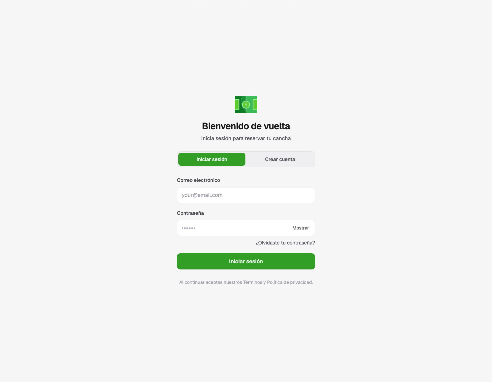

# Sistema de Reservación de Canchas de Fútbol — Frontend
 
Proyecto de clase (Desarrollo Web). Sistema self-service donde los clientes reservan canchas de fútbol por su cuenta, sin pasarela de pago: al reservar se genera un código de 5 caracteres que se presenta y valida en persona. Tres roles: **Cliente** (reserva), **Operador** (hace check-in y marca pagos), **Administrador** (gestiona todo).
 
Este repo es el frontend. El backend vive en un repo separado: `proj-daw-2026-backend`.


 
## Stack
 
React + Vite + TypeScript · Tailwind CSS v4 · shadcn/ui (Radix) · React Router · Axios · sonner (toasts)
 
## Cómo correrlo
 
1. Necesitas el **backend corriendo primero** (ver su propio README).
2. `npm install`
3. Crea un archivo `.env` en la raíz:
```
   VITE_API_URL=http://localhost:PUERTO/api
```
   (el puerto lo define el backend — revisa su `launchSettings.json`)

4. `npm run dev` → abre en `http://localhost:5173`